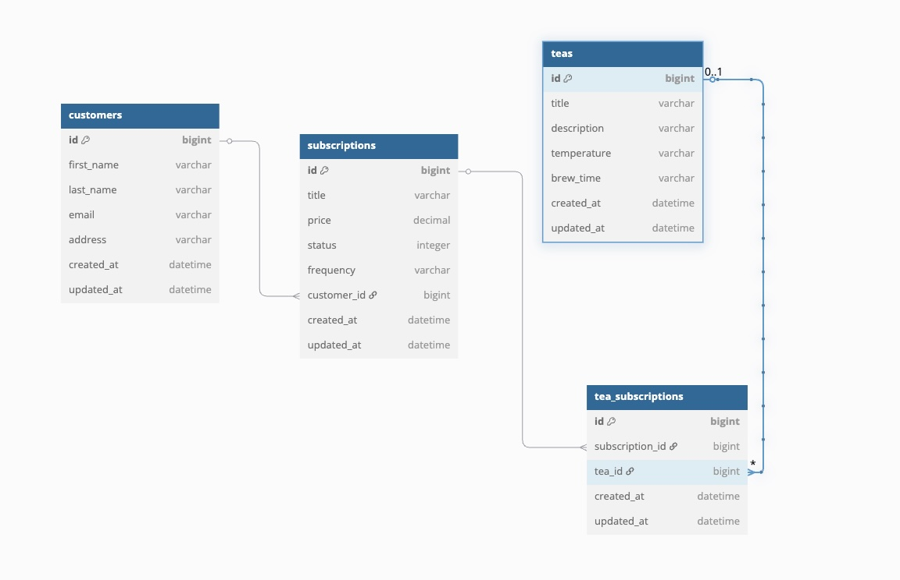

# The Jasmine Dragon - BE

## Overview

This is the backend API for The Jasmine Dragon, a tea subscription service where staff can view, and cancel various tea subscriptions. The API provides JSON:API-compliant endpoints and is designed to be consumed by a React frontend.Check out my frontend repo [here!](https://github.com/ldsauer/vite-react-starter)

### Notable Technologies

- Ruby
- Rails
- Postgres (PostgreSQL)
- RSpec
- simplecov

## Running Locally

### Setup Steps

1. Clone the repo to your machine: `git clone git@github.com:ldsauer/rails-api-starter.git`
2. Open the directory: `cd rails-api-starter`
3. Install required gems: `bundle install`
4. Setup the database: `rails db:{drop,create,migrate,seed}`
5. Start the server: `rails s`

### Running Test Suite

- To run the entire suite: `bundle exec rake`
- To run only the model tests: `bundle exec rspec spec/models`
- To run only the request tests: `bundle exec rspec spec/requests`

## Database Design

[](db/schema.rb)

## API Endpoints

`GET all subscriptions`
```
{
  "data": [
    {
      "id": "1",
      "type": "subscription",
      "attributes": {
        "title": "Green Tea Subscription",
        "price": "10.99",
        "status": "active",
        "frequency": "monthly"
      },
      "relationships": {
        "customer": {
          "data": { "id": "1", "type": "customer" }
        },
        "teas": {
          "data": [
            { "id": "5", "type": "tea" },
            { "id": "6", "type": "tea" }
          ]
        }
      }
    }
  ]
}
```
`GET subscription by id`

```
{
  "data": {
    "id": "1",
    "type": "subscription",
    "attributes": {
      "title": "Green Tea Subscription",
      "price": "10.99",
      "status": "active",
      "frequency": "monthly"
    },
    "relationships": {
      "customer": {
        "data": { "id": "1", "type": "customer" }
      },
      "teas": {
        "data": [
          { "id": "5", "type": "tea" },
          { "id": "6", "type": "tea" }
        ]
      }
    }
  }
}
```

`PATCH cancel subscription`

```
{
  "data": {
    "id": "1",
    "type": "subscription",
    "attributes": {
      "title": "Green Tea Subscription",
      "price": "10.99",
      "status": "cancelled",
      "frequency": "monthly"
    }
  }
}
```


## Contributors

### Logan Sauer

- [LinkedIn](https://www.linkedin.com/in/ldsauer/)
- [GitHub](https://github.com/ldsauer)

